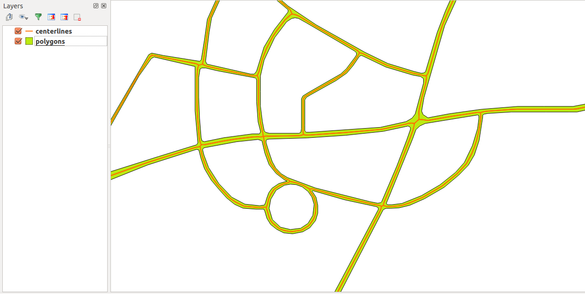

.. centerline documentation master file, created by
   sphinx-quickstart on Sat Jan  6 19:59:38 2018.
   You can adapt this file completely to your liking, but it should at least
   contain the root `toctree` directive.

Welcome to centerline's documentation!
======================================

.. image:: https://travis-ci.org/fitodic/centerline.svg?branch=master
    :target: https://travis-ci.org/fitodic/centerline
    :alt: Build

.. image:: https://coveralls.io/repos/github/fitodic/centerline/badge.svg?branch=master
    :target: https://coveralls.io/github/fitodic/centerline?branch=master
    :alt: Coverage

.. image:: https://img.shields.io/pypi/v/centerline.svg
    :target: https://pypi.python.org/pypi/centerline
    :alt: Version

.. image:: https://readthedocs.org/projects/centerline/badge/?version=latest
    :target: http://centerline.readthedocs.io/en/latest/?badge=latest
    :alt: Documentation Status

   The source and the output geometry visualized in `QGIS <https://www.qgis.org/en/site/>`_.

Roads, rivers and similar linear structures are often represented by long and complex polygons. Since one of the most important attributes of a linear structure is its length, extracting that attribute from a polygon can prove to be more or less difficult.

.. toctree::
   :maxdepth: 2
   :caption: Contents:

   installation.rst
   usage.rst
   faq.rst

.. toctree::
  :maxdepth: 4
  :caption: API:

  modules/centerline.rst

Indices and tables
==================

* :ref:`genindex`
* :ref:`modindex`
* :ref:`search`
